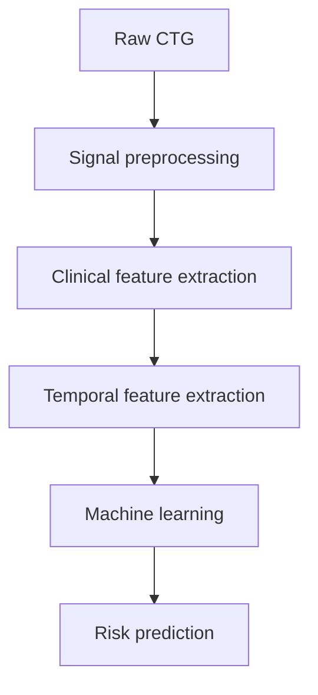

# CTG Fetal Risk Classification using Machine Learning

## Overview

Cardiotocography (CTG) records fetal heart rate (FHR) alongside uterine
contraction (UC) activity during pregnancy and labour. Clinicians interpret
these signals to assess fetal wellbeing, but long recordings, signal loss, and
variation between patients make consistent interpretation challenging.

This honours project investigates whether reproducible signal-processing and
classical machine-learning methods can classify a CTG recording as:

- **Normal**
- **Suspicious**
- **Pathological**

Earlier recognition of concerning patterns may support timely clinical review.
The project therefore emphasizes leakage-aware evaluation, minority-class
performance, signal-quality analysis, and preservation of the complete
experimental history.

## Dataset

The project uses the
[**CTU-UHB Intrapartum Cardiotocography Database**](https://physionet.org/content/ctu-uhb-ctgdb/1.0.0/),
which contains recordings from **552 patients**. Each WFDB record provides:

- fetal heart rate (FHR);
- uterine contraction activity (UC); and
- clinical outcome metadata in its header.

Raw records are stored as paired `.hea` and `.dat` files under `data/raw/`.
They are not committed to this repository; download instructions and the
required citation are provided in [`data/raw/README.md`](data/raw/README.md).

The source database does **not** provide the three project classification labels.
The `Normal`, `Suspicious`, and `Pathological` labels in this repository were
generated from available clinical outcome measures, including pH, base excess,
BDecf, and five-minute Apgar score. These outcome-derived labels are research
targets and should not be treated as an original CTU-UHB annotation standard.

## Pipeline



The finalized patient-level modelling dataset is
`data/processed/ml_dataset_final_temporal.csv`.

## Feature Engineering

The feature pipeline converts variable-length CTG traces into patient-level
numeric predictors.

- **Clinical features:** FHR baseline, accelerations, decelerations,
  bradycardia and tachycardia exposure, variability approximations,
  contractions, slopes, baseline crossings, and contraction–deceleration
  interactions.
- **Temporal features:** selected window-based summaries that retain limited
  information about within-record changes and poor-quality periods.
- **Signal-quality features:** valid-FHR coverage, missing-gap duration,
  possible artifact burden, and window-level quality summaries.

Missing samples terminate FHR events, artifact filtering is configurable, and
event and contraction thresholds are documented in the extraction code.
Several variability and event measurements are computational approximations,
not clinical gold-standard definitions.

Multiple controlled feature-engineering experiments were completed before the
final representation was selected. The repository retains the signal-quality
audit, temporal-information audit, quality-aware aggregation experiment,
limited temporal-feature experiment, and final temporal simplification
experiment, including negative and intermediate results.

## Models Evaluated

The final comparison evaluates exactly five classical machine-learning models:

1. Logistic Regression
2. Random Forest
3. XGBoost
4. LightGBM
5. Support Vector Machine with an RBF kernel

All models use the same patient partitions and evaluation protocol. Median
imputation is fitted within training data for every model. Logistic Regression
and SVM additionally receive fold-local standardization, while tree models use
unscaled features. SMOTE is applied only within training folds.

## Evaluation

The final evaluation combines:

- one fixed stratified train/test split;
- 30 predefined stratified train/test splits; and
- repeated 5×5 stratified cross-validation.

Reported metrics include accuracy, balanced accuracy, macro and weighted F1,
per-class recall, per-class precision, Pathological F1, false Pathological
predictions, true Pathological detections, and confusion matrices. Pairwise
comparisons against Logistic Regression use paired differences and bootstrap
confidence intervals; confidence intervals crossing zero are not presented as
evidence of statistical significance.

## Repository Structure

```text
ctg-fetal-risk-classification/
├── app/                 # Interactive Streamlit research dashboard
├── data/
│   ├── raw/             # Local CTU-UHB WFDB records
│   └── processed/       # Labels, engineered features, and modelling datasets
├── models/              # Saved model and label-encoder artifacts
├── notebooks/           # Exploratory data-analysis notebook
├── reports/             # Final comparison outputs used by the dashboard
├── src/
│   ├── analysis/        # Signal-quality, temporal, and error diagnostics
│   ├── data/            # CTG loading, label generation, and dataset assembly
│   ├── experiments/     # Controlled temporal and final model comparisons
│   ├── features/        # Clinical feature extraction and validation plots
│   ├── models/          # Baseline training and feature-ablation workflows
│   └── utils/           # Shared helper utilities
├── tests/               # Clinical feature-extraction regression tests
├── main.py              # Simple raw-record inspection entry point
├── requirements.txt     # Verified Python dependencies
└── README.md
```

## Installation

Python 3.10 was used to verify the documented environment.

From the project root:

```bash
python -m venv .venv
source .venv/bin/activate
python -m pip install --upgrade pip
python -m pip install -r requirements.txt
```

On Windows PowerShell, activate the environment with:

```powershell
.venv\Scripts\Activate.ps1
```

The raw CTU-UHB WFDB records must be available beneath `data/raw/` before
regenerating labels or features or using the raw-scan dashboard page. A local
symbolic link may be used when the dataset is stored outside the repository.

The local `.venv` directory is deliberately not part of the submitted
codebase. Recreate it from `requirements.txt` using the commands above.

## Running the Project

Run all commands from the repository root. The finalized processed datasets,
saved inference artifacts, and final model-comparison bundle are included. Raw
waveforms must be downloaded separately. Other generated report folders are
excluded.

### 1. Generate outcome-derived labels

```bash
python src/data/generate_labels.py
```

This reads clinical outcome fields from the raw headers and writes
`data/processed/labels.csv`.

### 2. Extract clinical and signal-quality features

```bash
python src/features/extract_clinical_features.py
```

This processes all raw CTG records and writes
`data/processed/clinical_features.csv`. It performs feature extraction only and
does not train a model.

### 3. Create the base machine-learning dataset

```bash
python src/data/create_ml_dataset.py
```

This merges clinical features with labels and writes
`data/processed/ml_dataset.csv`.

The finalized temporal representation is already stored at
`data/processed/ml_dataset_final_temporal.csv`. Its controlled selection process
is implemented in:

```bash
python src/experiments/final_temporal_simplification_experiment.py
```

That experiment protects existing outputs from accidental replacement. Use a
separate reproduction workspace when rerunning the full experiment chain.

### 4. Run the final five-model comparison

```bash
python src/experiments/final_model_comparison.py
```

The comparison reads the finalized temporal dataset and saved label encoder.
It refuses to overwrite the included `reports/final_model_comparison/` results.
Use a separate clean reproduction workspace if you need to rerun the comparison.

### 5. Run the feature tests

```bash
python -m unittest discover -s tests -v
```

### 6. Launch the research dashboard

```bash
streamlit run app/app.py
```

The dashboard presents the project overview, dataset and labels, feature
engineering, experiment journey, final model comparison, a combined CTG
scan-and-risk explorer with feature-contribution explanations, and a read-only
CSV inference demonstration.

The prediction page uses the existing saved 51-feature Logistic Regression
artifact. The final five-model experiment recommended SVM on the 55-feature
final representation but deliberately saved no trained artifact; the interface
keeps this distinction explicit and does not retrain either model.

## Reproducibility

- Dependency versions are pinned in `requirements.txt`.
- Final modelling uses the unchanged 552-patient temporal dataset and saved
  label encoder.
- Outcome fields, record identifiers, and the quality flag are excluded from
  model predictors to avoid target leakage or non-numeric metadata.
- Imputation, scaling, and SMOTE are fitted only on training data or training
  folds.
- Fixed seeds and patient-level stratification are defined in the experiment
  scripts.
- Experiment scripts protect generated reports from accidental overwrite.
- The final comparison bundle is included for the dashboard; other generated
  report folders are excluded from this code submission.

Because the data-generation commands write derived CSV files, reproduce the
full pipeline in a separate working copy when preservation of the committed
outputs is important.

## Results

The final experiment compares multiple classical machine-learning approaches
under identical preprocessing and evaluation protocols. Its implementation is
available in `src/experiments/final_model_comparison.py`, and the exact metric
tables and recommendation used by the dashboard are retained in:

[`reports/final_model_comparison/`](reports/final_model_comparison/)

## Future Work

Potential extensions include:

- external validation on an independent CTG cohort;
- evaluation on larger and more diverse datasets;
- deep-learning or sequence models operating directly on raw signals;
- probability calibration and clinically informed decision thresholds;
- prospective assessment with clinician input; and
- a clinician-facing interface with transparent quality warnings and model
  explanations.

## Disclaimer

This project is a research prototype developed for an honours project. It has
not been clinically validated and is **not intended for diagnosis, patient
management, or clinical decision making**. CTG interpretation must remain the
responsibility of appropriately qualified healthcare professionals.
